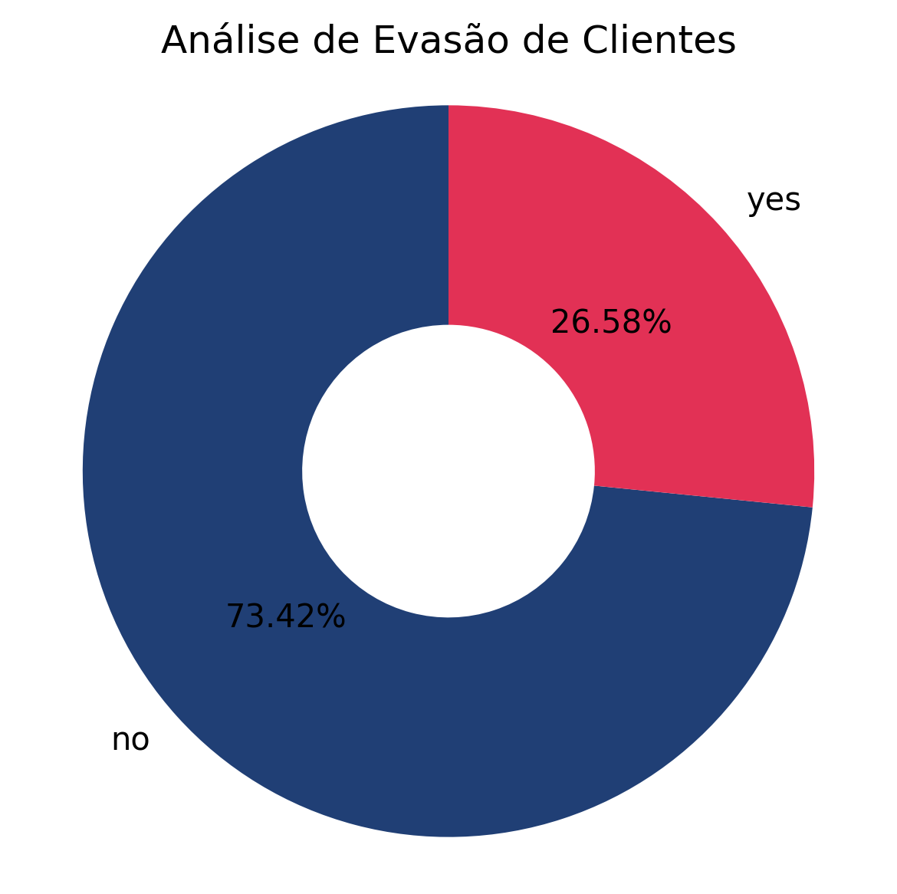

# <h1 align="center">Relatório Final - Telecom X</h1>

## Introdução
Este projeto teve como objetivo analisar a evasão de clientes (Churn) de uma empresa de telecomunicações. Compreender os fatores que levam os clientes a cancelar seus serviços é crucial para desenvolver estratégias de retenção eficazes. Através da análise de dados fornecidos, buscamos identificar padrões e correlações entre diversas variáveis do cliente e a propensão ao Churn, fornecendo insights acionáveis para a empresa.

## Limpeza e Tratamento de Dados
A etapa de limpeza e tratamento de dados foi fundamental para garantir a qualidade das análises. Os passos realizados incluíram:

1.  **Importação e Normalização:** Os dados foram importados de um arquivo JSON e as colunas aninhadas ('customer', 'phone', 'internet', 'account') foram normalizadas para criar um DataFrame plano (`df_normalizado`).

2.  **Tratamento de Valores Vazios/Nulos:**
    *   Identificamos 224 valores vazios na coluna 'Churn' (`df_normalizado['Churn'].value_counts()`) que foram substituídos por `np.nan` e posteriormente removidos, resultando em um DataFrame mais limpo.

    *   A coluna `Charges.Total` também continha valores vazios (' ') que causavam erro na conversão para tipo numérico. Esses valores foram convertidos para `NaN` e as 11 linhas afetadas (que representavam uma pequena parcela dos dados) foram removidas, visto que correspondiam a clientes com `tenure` zero.

3.  **Padronização de Nomes de Colunas:** Os nomes das colunas foram padronizados para o formato `snake_case`.

4.  **Padronização de Valores Categóricos:**
    *   Valores de string em colunas do tipo 'object' (excluindo 'customer_id', 'gender', 'contract', 'payment_method') foram convertidos para minúsculas.

    *   Valores 'yes' e 'no' foram convertidos para 1 e 0, respectivamente.

    *   Valores 'yes', 'no' e 'no internet service' foram convertidos para 1, 0 e 2, respectivamente.

5.  **Criação de Novas Características:** Uma nova coluna, `contas_diarias`, foi criada calculando o `charges_monthly` dividido por 30.

6.  **Criação de DataFrame Final:** Um novo DataFrame, `df_final`, foi criado a partir do `df_normalizado` para aplicar as transformações numéricas nas variáveis categóricas e preservar o original para algumas análises.

## Análise Exploratória de Dados (EDA)
A EDA revelou insights importantes sobre a distribuição do Churn e suas relações com outras variáveis:

1.  **Distribuição de Churn:** Uma análise inicial mostrou a proporção de clientes que churnaram versus os que não churnaram através de gráficos de barras e pizza. Identificamos a presença de 224 valores vazios (' ') que afetavam a visualização inicial e foram posteriormente tratados. Após a limpeza, a distribuição ficou clara, mostrando a base de clientes que permanecem e os que evadem.

2.  **Relação entre `SeniorCitizen` e Churn:**
    *   Clientes **não idosos** (0) tiveram uma taxa de churn de aproximadamente **23.65%**.

    *   Clientes **idosos** (1) apresentaram uma taxa de churn significativamente mais alta, de **41.68%**.

    *   **Insight:** Clientes idosos são mais propensos a churnar, indicando a necessidade de estratégias de retenção específicas para este grupo.

4.  **Relação entre `Contract` e Churn:**
    *   Contratos **Mês a Mês** (`month-to-month`): **42.71%** de churn.

    *   Contratos de **Um Ano** (`one year`): **11.28%** de churn.

    *   Contratos de **Dois Anos** (`two year`): **2.85%** de churn.

    *   **Insight:** Existe uma forte correlação inversa entre a duração do contrato e o churn. Contratos de longo prazo são eficazes na retenção de clientes.

5.  **Relação entre `PaperlessBilling` e Churn:**
    *   Clientes **sem cobrança sem papel** (0): **16.38%** de churn.

    *   Clientes **com cobrança sem papel** (1): **33.59%** de churn.

    *   **Insight:** Clientes que optam pela cobrança sem papel são mais propensos a churnar, sugerindo que este grupo pode ter expectativas diferentes ou ser mais sensível a outros fatores.

6.  **Relação entre Serviços e Churn (`phone_service`, `multiple_lines`, `internet_service`, `tech_support`, `streaming_tv`, `streaming_movies`):**

    *   **`internet_service`:** Clientes **sem o serviço de internet** têm uma taxa de churn de **7,43%**. Clientes **com internet DSL** têm **19%** de evasão. Clientes que possuem o serviço de **Fibra Ótica** têm a maior taxa de evasão **41,89%**.

    

    *   **`tech_support`:** Clientes **sem suporte técnico** têm uma taxa de churn de **41.65%**, enquanto clientes **com suporte** têm apenas **15.20%**. Clientes sem serviço de internet (e, portanto, sem 'suporte técnico' para internet) têm a menor taxa de **7.43%**.

    

    *   **`streaming_tv`:** Clientes **sem streaming TV** têm **33.54%** de churn, e clientes **com streaming TV** têm **30.11%**. Novamente, clientes sem serviço de internet têm **7.43%** de churn.

    

    *   **`streaming_movies`:** Clientes **sem streaming de filmes** têm **33.73%** de churn, e clientes **com streaming de filmes** têm **29,95%**. Clientes que não possuem possuem o serviço têm **7.43%** de churn.

    

    *   **`phone_services`:** Clientes **sem serviços telefônicos** representam **25%** de churn, e clientes **com serviços telefônicos** correspondem a **26,75%** de evasão.

    

    *   **`multiple_lines`:** Clientes **sem multiplas linhas telefônicas** correspondem a **25,08%** de churn, clientes **com multiplas linhas telefônicas** representam **28,65%**. Clientes que não possuem o serviço telefônico tem **25%**. 

      

    *   **Insights Gerais sobre Serviços:** Serviços de suporte (como `tech_support`) são cruciais para a retenção, diminuindo significativamente o churn. Outros serviços de entretenimento (streaming) têm um impacto menor ou mais complexo. A ausência de serviço de internet consistentemente leva a um churn mais baixo, o que pode indicar que esses clientes têm necessidades mais básicas e são mais fáceis de reter. O serviço de **Fibra Ótica** é um fator preocupante e deve ser dada uma atenção especial ao serviço.

7.  **Correlações com Churn:**

    *   **Negativa mais forte:** `tenure` (-0.35), `online_security` (-0.33), `tech_support` (-0.32). Indicam que quanto mais tempo o cliente fica, e quanto mais serviços de segurança/suporte ele possui, menor a chance de churn.

    *   **Positiva mais forte:** `charges_monthly` (0.19), `contas_diarias` (0.19), `paperless_billing` (0.19), `senior_citizen` (0.15). Indicam que gastos mensais mais altos, cobrança sem papel e ser um cliente idoso estão associados a uma maior propensão ao churn.

## Conclusões e Insights

*   **Tempo de Contrato é Rei:** A duração do contrato é o fator mais crítico na retenção de clientes. Clientes com contratos de um ou dois anos são significativamente mais leais.

*   **Serviços de Suporte Agregam Valor:** Serviços como suporte técnico e segurança online têm um impacto substancial na redução do churn. Eles provavelmente contribuem para a satisfação e confiança do cliente.

*   **Atenção aos Gastos Mensais:** Clientes com contas mensais mais altas apresentam uma ligeira, mas notável, correlação positiva com o churn, sugerindo que o valor percebido versus o custo pode ser um problema para alguns.

*   **Clientes Idosos e Cobrança Sem Papel:** Estes dois grupos demonstram uma maior propensão ao churn. Para clientes idosos, isso pode ser um sinal de dificuldades com a tecnologia ou necessidades específicas não atendidas. Para a cobrança sem papel, pode indicar um perfil de cliente mais engajado digitalmente e, talvez, mais propenso a comparar e mudar de serviço.

*   **Segmentação:** A análise mostra que diferentes segmentos de clientes (por exemplo, baseados em idade, tipo de contrato ou serviços contratados) têm perfis de churn distintos. Uma abordagem única para retenção não será eficaz.

## Recomendações

Com base nas análises realizadas, as seguintes recomendações podem ajudar a empresa a reduzir o churn:

1.  **Incentivar Contratos de Longo Prazo:** Criar programas de fidelidade, descontos progressivos ou benefícios adicionais para clientes que optam por contratos de um ou dois anos. Focar os esforços de vendas e marketing na promoção desses planos.

2.  **Fortalecer Serviços de Suporte e Segurança:** Destacar o valor do suporte técnico, segurança online e outros serviços de proteção na comunicação com o cliente. Garantir a qualidade desses serviços para maximizar a satisfação e a retenção.

3.  **Monitorar Clientes de Alto Gasto:** Desenvolver alertas para clientes com encargos mensais elevados. Oferecer revisões de conta proativas ou pacotes de valor agregado para justificar o custo e evitar a insatisfação.

4.  **Estratégias Específicas para Idosos:** Investigar as necessidades e preferências dos clientes idosos. Considerar programas de treinamento, suporte técnico simplificado ou pacotes adaptados para melhorar sua experiência e reduzir o churn.

5.  **Reavaliar Experiência de Cobrança Sem Papel:** Entender por que clientes que optam pela cobrança sem papel churnam mais. Pode ser necessário otimizar a experiência digital, garantir que as contas sejam claras e transparentes, ou oferecer canais de suporte digital mais eficazes.

6.  **Segmentação para Retenção:** Desenvolver campanhas de retenção personalizadas para diferentes segmentos de clientes, com base nos fatores de churn identificados. Por exemplo, oferecer incentivos de contrato mais longo para clientes mês a mês, ou reforçar o valor do suporte para aqueles que não o utilizam.
